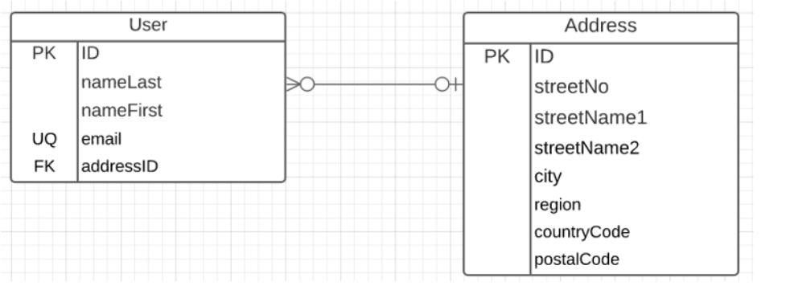
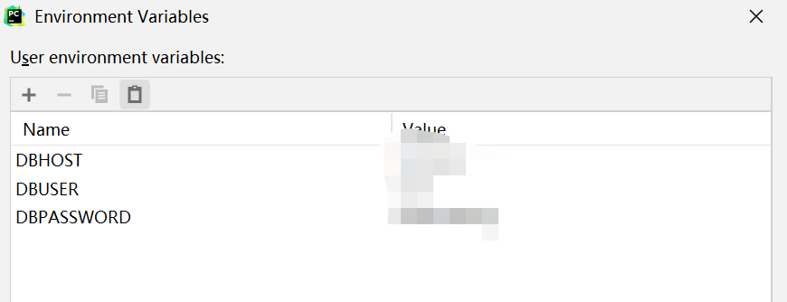

#### Current API

/users (GET, POST)

/users/<userID> (GET, PUT, DELETE)

/addresses (GET, POST)

/addresses/<address_ID> (GET, PUT, DELETE)

#### Data

#### Tips on run locally

sql script:  located at "\SQLScripts\create_userdb.sql"

