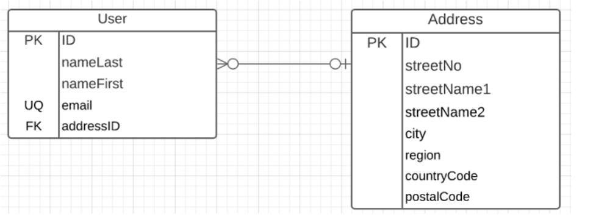

task 7  of sprint 2

#### Current API

/users (GET, POST)

/users/<userID> (GET, PUT, DELETE)

/addresses (GET, POST)

/addresses/<address_ID> (GET, PUT, DELETE)

/users/<userid>/addresses (GET)

/addresses/<addressid>/users (GET)

#### Data

sql script:  located at "\SQLScripts\create_userdb.sql"

#### Run environment

DBHOST: 

DBUSER: 

DBPASSWORD: 

SMARTY_AUTH_ID:

SMARTY_AUTH_TOKEN:

